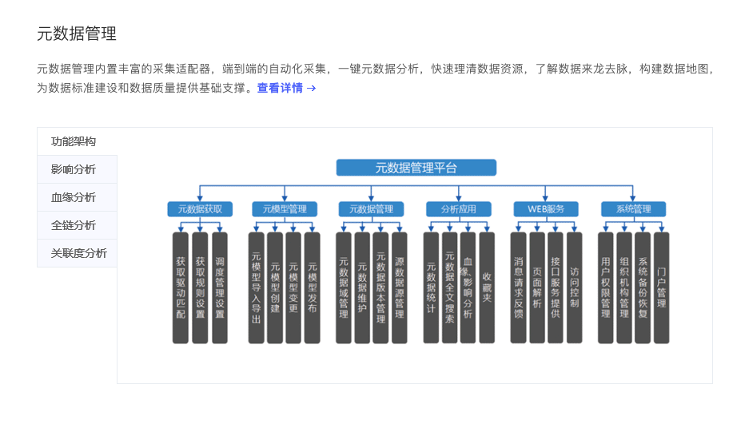

# 元数据管理论文

## 小结

## 亿信元数据管理平台

* 地址
  * https://www.esensoft.com/products/espowermeta.html
  * https://www.esensoft.com/products/espowermeta/2210.html
* 简介
  * 致力于处理技术元数据、业务元数据、管理元数据，帮助各行各业用户获取更多数据通查理，进而挖掘出隐藏在资源中的架子。
* 基本功能
  * **元数据自动化采集**
    * 
  * 元模型管理
    * 管理元数据的模型
  * 元数据分析
    * 影响分析
    * 血缘分析
    * 全链分析
    * 关联度分析
    * 属性差值分析
    * 元数据对比分析
    * 重复元数据分析
    * 数据标准映射覆盖率分析
    * 
  * 全文搜索引擎 
    * 智能搜索元数据关联
  * 可视化管理
  * 版本管理
* 

## 参考文献:

## 