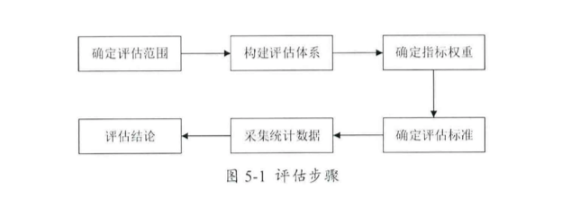

# 数据交换论文

## 亮点

* 并行计算加速
* 异常流量监测
* 数据的传输安全问题

## 亿信数据交换管理平台

* 地址
  * https://www.esensoft.com/data-governance.html?utm_source=bdads&utm_medium=cpc&utm_campaign=datagovernance

## 教学资源数据交换平台关键技术研究与应用_香丽芸

### 概念

* 异构数据交换平台 基于XML
  * 信息标准化准则
  * 数据交换平台体系结构一集集异构关系数据库的体系结构
  * XML文档转化及数据并发策略
* 数据交换效率
* 数据传输时端到端的性能评估问题  减法法则
* 范洪DOS/DDOS攻击监测算法
* OpenMP数据平台并行数据处理方法
* 数据挖掘 决策树 新C4.5

### 并行交叉开关

* 向量处理器分配内存
  * 能够同步进行综合数据的运算操作，大多数的 CPU 属于纯量处理器，只能一次处理一个要素
* 并行化容争交叉开关

## 瓶颈宽带测量方法

* 减法模型监测不对称包到达流量
* SNMP 不适用端到端的客服
* Pathchar瓶颈宽带监测方法
* 数据包对的品鉴宽带监测方法
* 亮点：基于IPv6设计  ICMPv6的新特点

### 异常流量监测方法

* 误用监测法 
* 基于IPv6
* 异常流量监测算法

### OpenMP的并行化程序模型在数字交换平台中的研究

* OpenMP是面向共享内存的线程级并行系统的一套适合多核处理器的并行程序设计的编译处理方案。
* OpenMP并行算法高层抽象描述
* 文献39 78  79 80 81 82 83 84 85 86程序开销分析模型 87 88 89
* 分为串行区域，并行区域  FORK JOIN
* OpenMP启动开销、隐形同步、显性同步以及加速因子

## 应用于异构电子政务平台的数据交换方法_陆逸波

* 第二章  技术研究及体系构建
  * 基于XML的数据交换技术，构建数据交换方法
  * EDI电子交换技术
    * 缺点
      * 交换限制多 特定的数据传输协议和安全加密协议
      * 固定的步骤和响应的转换原则  灵活性差
      * 无统一的标准
  * 基于中间件的数据交换技术
    * 缺点
      * 定制数据 不便于重用
      * 
  * 基于JSON的数据交换技术和基于XML的数据交换技术
* 第三章 数据交换安全性和完整性保证
  * 数据交换安全
  * 
* 第五章
  * 数据交换平台数据交换方法评估体系构建
    * 
    * 德尔菲法
* 参考文献
  * 电子政务系统中的数据交换和共享服务平台设计
  * XML加密方法的研究与实现
  * XML加密
  * 基于JSON的地理信息数据交换方法研究
  * 基于XML消息的安全数据交换平台研究与应用

## 某银行数据交换系统的设计与实现_吴勇

* 第二章  相关分析
  * 数据采集
  * 数据处理/存储
  * 数据分发
* 参考文献
  * 一种面向集群环境的ETL调度算法
  * 面向数据集成的分布式ETL研究与设计
  * 基于Hadoop的图书馆符合大数据村存储系统研究

## 基于数据交换技术的残疾学生资助系统的设计与实现_谢军

* 第二章 系统关键技术
  * 数据交换引擎
    * 将异构数据过滤，整理，转换，加工成同构数据保存在权威数据源
    * 权威数据库
    * 异构系统的数据库
  * 系统数据接口
  * 数据交换平台

## 应用于异构电子政务平台的数据交换方法_陆逸波

* 第二章
  * 数据交换技术比较与选择
    * EDI
    * 基于消息中间件
    * 基于JSON数据交换
    * 基于XML数据交换
* 第三章 
  * 加密数据，保证交换数据的完整性和安全性
* 第五章
  * 交换数据方法评估体系