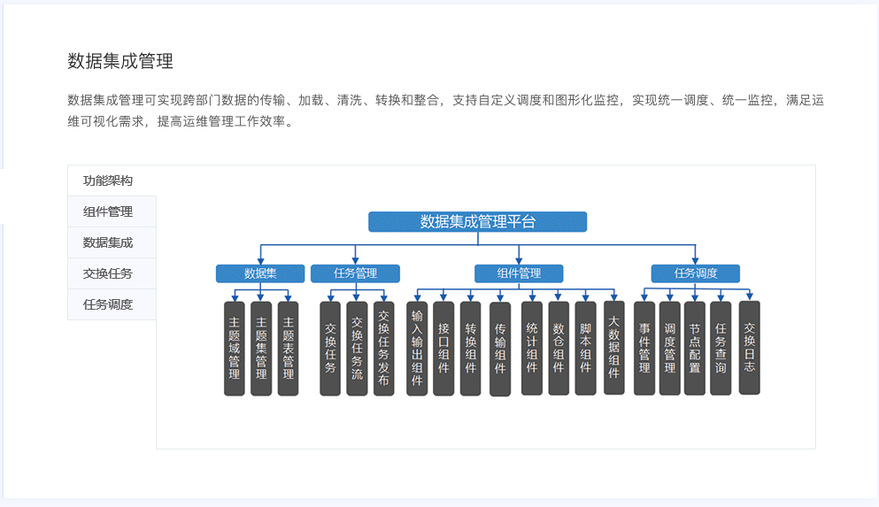

# 数据集成管理论文

## 亿信元数据管理平台

* 地址
  * https://www.esensoft.com/data-governance.html?utm_source=bdads&utm_medium=cpc&utm_campaign=datagovernance
* 简介
  * 数据集成管理科实现跨部门数据的传输、清洗、转换和整合，支持自定义调度和图形化监控，实现统一调度没同意监控，满足运维可视化需求，提高运维管理工作效率
* 功能
  * 组件管理
  * 数据集成
  * 交换任务
  * 任务调度
* 

